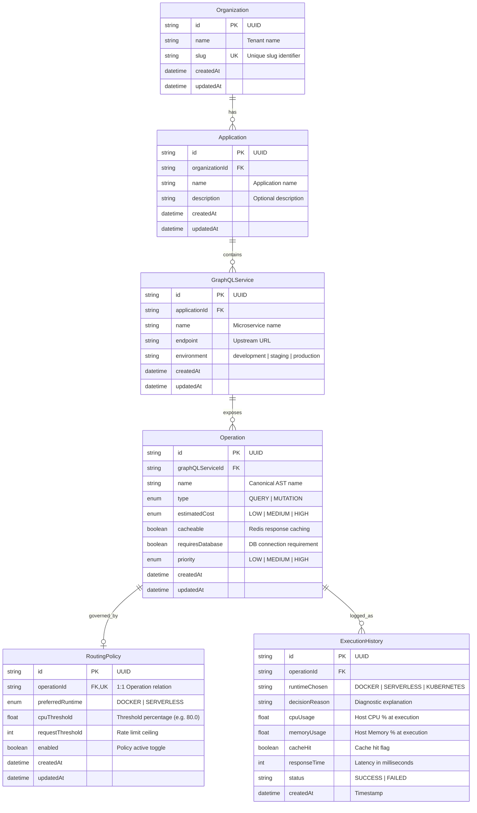

# SpikeFlow Database Architecture & Data Modeling Specification

## 1. Storage Architecture Overview

SpikeFlow employs a dual-tiered data persistence strategy combining:
- **Persistent Relational Store (PostgreSQL 17):** Governs multi-tenant configuration, metadata hierarchies, routing policies, and audit logs.
- **Fast-Path In-Memory Store (Redis 8):** Caches resolved query tuples, service metadata, and performance-critical gateway lookups.

---

## 2. Relational Entity Schema (PostgreSQL via Prisma ORM)



---

## 3. Redis Caching Topology & Invalidation Strategy

To achieve sub-millisecond query metadata resolution, SpikeFlow implements an active cache-aside pattern with automatic invalidation on updates.

### 3.1 Cache Key Namespace Specifications

| Cache Key Pattern | Data Structure | TTL | Purpose |
| :--- | :--- | :--- | :--- |
| `operation:{operationName}` | String (JSON) | 1 hour | Serialized `Operation` metadata |
| `service:{serviceId}` | String (JSON) | 1 hour | Serialized `GraphQLService` connection parameters |
| `routingPolicy:{operationId}` | String (JSON) | 1 hour | Serialized `RoutingPolicy` threshold configuration |
| `resolved:{operationName}` | String (JSON) | 1 hour | Consolidated `{ operation, service, policy }` tuple |

### 3.2 Invalidation Workflow
Whenever an `Operation`, `GraphQLService`, or `RoutingPolicy` is modified via GraphQL mutations, SpikeFlow invalidates the primary key and the composite `resolved:<name>` key:

```typescript
// Pattern: Write to PostgreSQL -> Invalidate Redis -> Reload on next read
async invalidateCacheByName(operationName: string): Promise<void> {
  await Promise.all([
    this.cache.delete(CacheKeys.operation(operationName)),
    this.cache.delete(CacheKeys.resolvedRequest(operationName)),
  ]);
}
```
