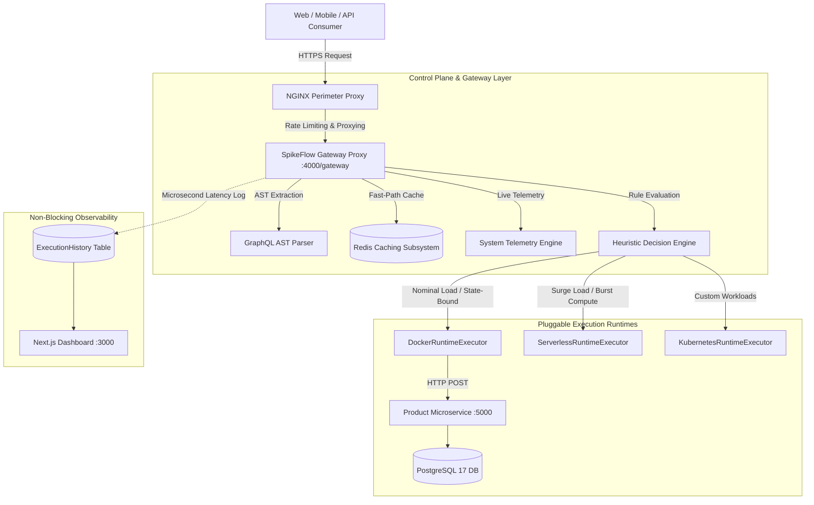
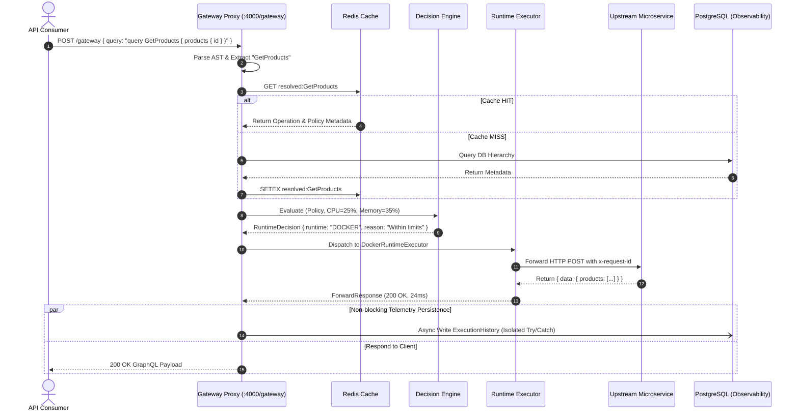

# SpikeFlow Architectural Specification & Systems Design

## 1. Executive Summary & Core Value Proposition

**SpikeFlow** is an intelligent execution and adaptive orchestration layer for GraphQL workloads. Modern distributed architectures frequently struggle with the trade-offs between stateful, containerized microservices and stateless, ephemeral serverless functions. 

SpikeFlow resolves this conflict by implementing a **transparent heuristic routing gateway** that evaluates GraphQL query ASTs against live hardware telemetry (CPU, Memory, Request Velocity) and declarative routing policies to orchestrate query execution to the optimal compute target dynamically.



---

## 2. Layer-by-Layer Architectural Decomposition

### 2.1 Perimeter Ingress & Reverse Proxy (NGINX)
Positioned at the edge boundary, NGINX provides:
- **Perimeter Defense & Rate Limiting:** Throttles abusive traffic bursts and mitigates volumetric denial-of-service attempts.
- **TLS Termination & Keep-Alive Pooling:** Offloads cryptographic overhead from application workers.
- **Route Isolation:** Exposes public endpoints (`/gateway` and `/graphql`) while isolating internal subgraph networks.

### 2.2 Core Gateway & Automatic Resolution Layer
The Gateway acts as the central coordinator:
1. **Document Ingress:** Receives `POST /gateway` payloads containing GraphQL queries, operation names, and variables.
2. **Sub-Millisecond AST Parsing:** Uses the `graphql/language` compiler to extract the canonical `OperationDefinition` and type (`QUERY` vs `MUTATION`) without evaluating field resolvers.
3. **Multi-Tiered Cache Invalidation & Resolution:** Queries Redis for resolved metadata keys (`resolved:<opName>`). On a cache miss, it resolves the `Operation` $\to$ `GraphQLService` $\to$ `RoutingPolicy` chain from PostgreSQL and populates Redis with TTL expiration.

### 2.3 Heuristic Decision Engine
The `DecisionEngineService` evaluates runtime placement based on:
- **Operation Priority & Cost:** `LOW`, `MEDIUM`, `HIGH` complexity heuristics.
- **Database Dependency:** Prevents database pool exhaustion by keeping stateful transactional writes on persistent containers.
- **Host Hardware Telemetry:** Interrogates real-time CPU and memory metrics via `systeminformation`.
- **Threshold Policies:** Automatically triggers serverless offloading when host CPU exceeds user-configured thresholds (e.g., $>80\%$).

### 2.4 Pluggable Runtime Executor Pattern
To ensure the gateway remains transport-agnostic, execution is delegated to an interface-driven runtime executor registry:
```typescript
export interface RuntimeExecutor {
  readonly runtime: Runtime | string;
  execute(request: ForwardRequest): Promise<ForwardResponse>;
}
```
- **`DockerRuntimeExecutor`**: Dispatches HTTP POST requests to upstream containerized GraphQL services and transparently returns upstream responses verbatim.
- **`ServerlessRuntimeExecutor`**: Invokes auto-scaling serverless cloud functions (AWS Lambda, Google Cloud Functions) during surge events.
- **`KubernetesRuntimeExecutor` / Custom Executors**: Extensible registry supporting dynamic injection of batch compute engines.

### 2.5 Non-Blocking Telemetry & Observability Layer
Observability failure must **never** break client traffic. The gateway records execution metrics inside an asynchronous, isolated error boundary (`recordHistorySafely`):
- Execution UUID, Operation ID, Runtime Chosen, Decision Reason.
- Precise latency measurement using `performance.now()`.
- CPU and Memory telemetry at the instant of execution.
- Cache hit/miss status and HTTP status codes.

---

## 3. High-Throughput Request Lifecycle Sequence



---

## 4. Architectural Characteristics & SLA Targets

- **Gateway Proxy Overhead:** $\le 5\text{ ms}$ average latency addition over direct microservice calls.
- **Cache Hit Ratio Target:** $> 95\%$ for steady-state GraphQL query metadata resolution.
- **Observability Availability:** $99.99\%$ (Client requests execute successfully even during complete database logging outages).
- **Scale Horizon:** Zero cold-start latency for stateful operations, infinite horizontal elasticity for stateless surge operations.