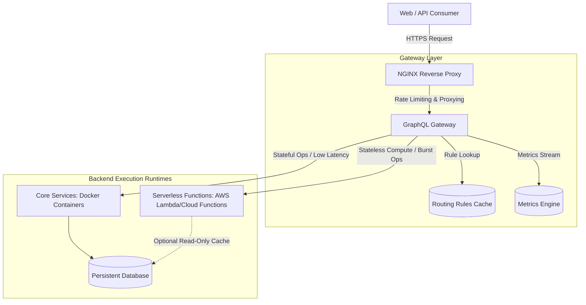
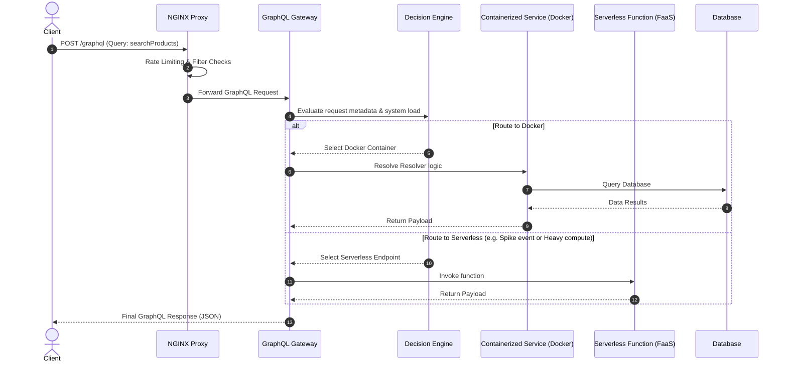

# SpikeFlow High-Level Architecture

SpikeFlow utilizes a hybrid execution model combining a highly-configurable GraphQL Gateway, a reverse-proxy routing layer (NGINX), and dual backend runtimes (Docker Containers + Serverless Functions). 

---

## 1. System Topology Diagram



---

## 2. Core Architectural Components

### 2.1 Traffic Control Layer (NGINX)
NGINX sits at the perimeter of the architecture and performs:
- **Rate Limiting:** Protects the gateway from client-level abuse.
- **SSL Termination & Caching:** Offloads static content caching and TLS processing.
- **Initial Route Filters:** Rejects requests with invalid schemas or malformed headers before they reach the Node.js process.

### 2.2 GraphQL Gateway
The central coordinator of the platform. Instead of simply forwarding requests:
1. It parses the incoming GraphQL Document.
2. It extracts the **Operation Name** and **Variables**.
3. It fetches execution metadata for the operation (e.g., database requirements, latency tolerance, priority).
4. It calls the **Decision Engine** to select the target runtime (Docker or Serverless).
5. It executes/proxies the request to the chosen runtime and gathers metrics.

### 2.3 Stateful Runtime (Docker Containers)
- **Use Case:** Stateful, persistent-connection, database-heavy operations (e.g., processing checkouts, updating user profiles, managing orders).
- **Benefits:** Low database connection overhead (persistent pool), predictable performance, zero cold starts.

### 2.4 Serverless Runtime (FaaS)
- **Use Case:** High-compute, short-lived, burst-heavy operations (e.g., intensive fuzzy-search, product catalog analytics, batch invoice generation).
- **Benefits:** Scales to zero when idle, handle millions of concurrent operations during spike events without affecting core systems.

---

## 3. End-to-End Request Flow

The execution lifecycle of a request follows this pipeline:



### Request Pipeline Hierarchy
```
Client Request
      ↓
NGINX Proxy (Filters, Rates)
      ↓
GraphQL Gateway (AST Parse)
      ↓
Operation Selection
      ↓
Metadata Enrichment (Operation Cost, Priority)
      ↓
Routing Policy Evaluation (Decision Engine)
      ↓
Execution Runtime (Docker vs Serverless)
      ↓
GraphQL Response Serialization
```

---

## 4. Key Architectural Decisions

### Why GraphQL as the API Gateway?
Unlike REST where routes are static URL paths (e.g., `/api/products`), GraphQL allows single-endpoint access with highly flexible query payloads. By compiling the query string into an Abstract Syntax Tree (AST), SpikeFlow can inspect the *exact field structure* of what the client requested and make routing decisions based on the query complexity.

### The Hybrid Execution Model
Traditionally, companies must choose between fully serverless (high latency, cold start issues, DB pool exhaustion) or fully containerized (expensive peak provision). SpikeFlow uses a hybrid approach: **stateful reads/writes remain containerized**, while **heavy read search/analytics or volatile traffic operations are offloaded to Serverless**, combining the best of both worlds.